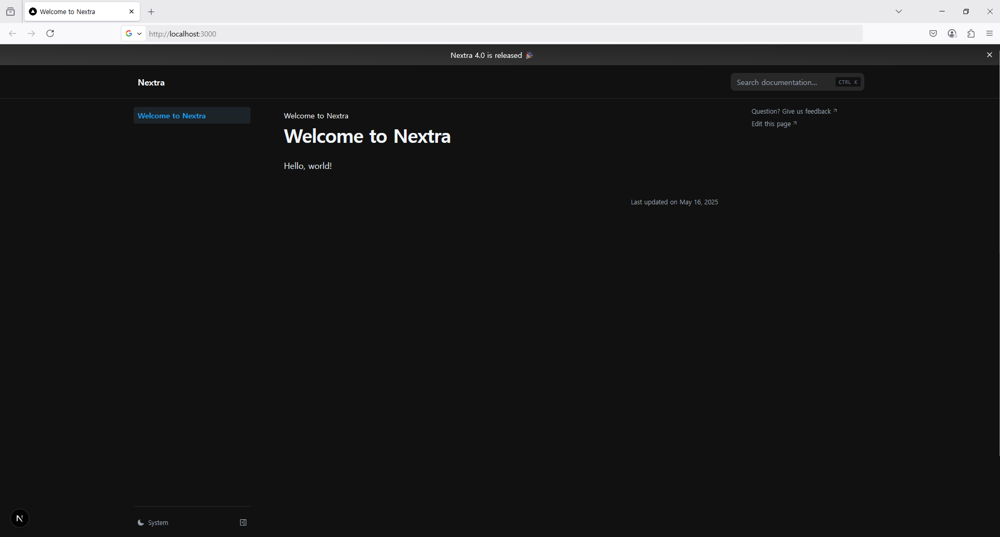

# Nextra Docs TypeScript Sample

This is a minimal **Next.js + Nextra Docs** starter project, created by following the official [Nextra Docs Theme Getting Started Guide](https://nextra.site/docs/docs-theme/start).

> This project is configured using **TypeScript**, **Next.js App Router**, and **Nextra Docs Theme**.

---

## 🚀 Getting Started

To run this project locally:

```bash
# Install dependencies
npm install
# or
yarn
# or
pnpm install
# or
bun install

# Start the dev server
npm run dev
# or
yarn dev
# or
pnpm dev
# or
bun dev

```


